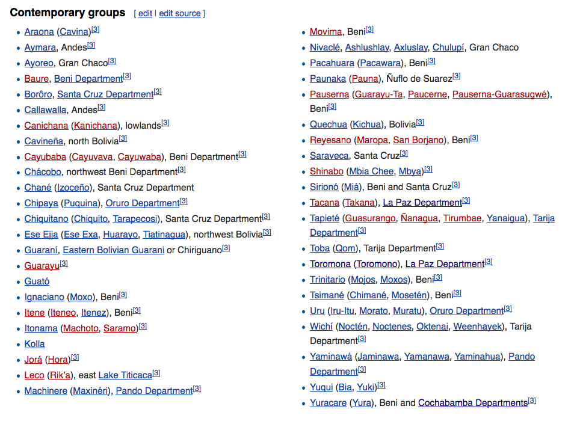
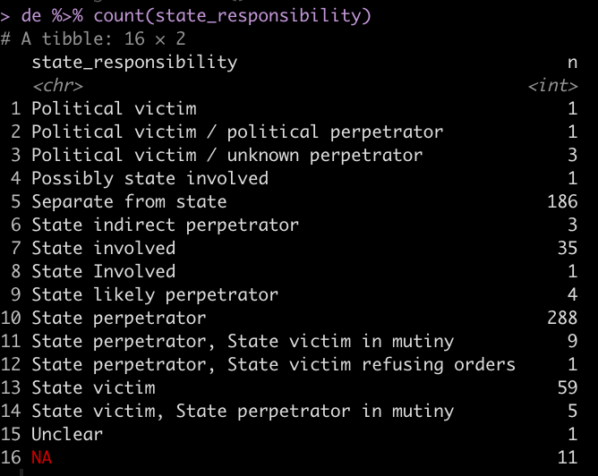

# Data Variables and Coding Advice

An initial spreadsheet of when, who, where, how, responsible party, in order of left to right in spreadsheet

* `event_title`: *Provides location and general theme of event*
 
**Event titles are brief, unique textual identifiers** that should readily bring to mind the event (especially if the reader has heard of it before), and inform us as to what makes it distinctive. Therefore, unlike other elements of this codebook, there is rarely a single right answer. Also, we should be working to make these titles distinct, so when there are a lot of parallel events, we will need to be more specific.
 
 Use well-known names for events, if possible.

 The event_title should state the _scope_ of the conflict; name a locality or workplace if the conflict (or the notable deadly violence) is local. If the conflict is widespread, it should more often name the movement involved. It should name the social movement sector involved if relevant. 
 
 It should not name the form of violence unless it is unusual. 
 
 **Unique** means that each event_title is distinct from all others in the dataset. Where needed add the year at the end of the event_title, then month or month pair. For example "Gas War 2003", "CSUTCB mobilization April 2000."
 
The variables, and this document are segmented into sections, each of which comprise several variables.

## When:

* `year`
* `month`
* `day`: Date of the incident that caused death

Integer values. Four-digit years, months from 1 to 12, days from 1 to 31.

* DayLater: `later_year`, `later_month`, `later_day`: Date of death, if the person died after the incident due to its consequences. 

Occasionally, we have an indeterminate date. Code these with the known information: October 2003 as 2003\|10\|\[blank\]. Use “or”, as in October 5 or 6 or 7, 2006 as 2006\|10\|5 or 6. 

*Handling in R:* Currently, our coding takes the first number in a textual date, retains the whole text as a note about the year, month, or day. Blank dates are automatically turned into a note reading “Unknown year” etc.

*In the narrative:* State the time if available. 

*Future options:* Integrate with temporal sequence of the larger conflict (i.e., chronology of conflict could be an extended text field or link to other material)

## Who: Victim/Deceased individual

Note that we may choose to apply the term "victim" to deliberate deaths, according to whatever categories we choose, but the generic category in the dataset is "deceased."

### Names

* `dec_firstname`, `dec_surnames`: Broken into first names, surnames. 

Do not use `?` to indicate uncertainty. Use parentheses `()` or slashes `/` instead.

If more than one name is found in the box:

 - FirstName (other FirstName)- implies we think the victim’s name is the name outside of the parentheses, but a report may have indicated an alternate name

 - FirstName / FirstName -implies that we have no idea which of the two is correct

 - If there are slashes in both first name and surname, they should be read as paired. A / B ; C / D, means the name is either A B or C D.

 - For last name use one of the following: PatronymicSurname MatronymicSurname

   - PSurname (PSurname alt) MSurname

   - PSurname MSurname (PSurname MSurname both alt)

   - PSurname MSurname (MSurname alt)

   - SingularSurname (SingularSurname alt)

For now, **include** names used in sources that are **plausible misspellings** among these alternative names (e.g., Miguel \| Northfuster (Northdufter) Kerer). Likewise the **multiple names for someone who has not been positively identified**: Juan Carlos / Corado / Corado / NN \| Ventura / Vilca / Veizaga / Fernández / Bejarano.

When we have *explicit reporting* that a name was wrong, put the correct name in the name field and **describe the misidentification** in Complications: Gustavo \| Cartagena Trujillo \| Victim initially misidentified as "Edgar Vidal Rocha."

### Internal unique identifier(s)
* `id_indiv` — A unique identifier for each individual in the dataset that allows for cross referencing as the dataset evolves.

We want to be able to track changes in knowledge about individuals, for all fields including their names, so we assign each individual a unique identifier. This means that if their name changes, we change their inclusion status in the database (because, for example, we determine their death was accidental, or were misreported as dead), regroup them with different events, or determine that they are in fact a duplicate of another person, we can link that individual across different versions of the dataset.

Unique IDs will also be assigned to individuals in the "Excluded from current analysis" tab once that tab is refactored to include all existing variables.

Individual ID (`id_indiv`) will take the form of the lowercase letter i followed by five numerical digits.
- i — is for individual (a conveniently bilingual first letter)
- First two digits assigned by year and allowing the research team to keep the unique ID's roughly chronological without generating confusion among uninformed researchers.
- - **01** Indicates an unknown year
- - **02** corresponds to **1982**; *10* corresponds to 1990; *20* to 2000; *30* to 2010; *40* to 2020. So, deaths in 2019 would typically begin i39
- Last three digits are assigned sequentially in rough chronological order, beginnig with **001**. 
- - Where multiple events are occurring simultaneously, we will try to number sequentially within the events first.
- - **Every line** in the dataset gets an individual ID, *including* unconfirmed = TRUE, intentionality = Nonconflict accident, etc.

### Demographic characteristics
* `dec_age`: reported age 
* `dec_alt_age`: alternatively reported ages

Expressed as an integer. Unless under two years, then we may also have a fraction in twelths.

**Data entry for months:** Type: \<equals\> \<number of months\> \<division slash\> 12.

So six months: “=6/12.”

* `dec_gender`: gender

Options: M, F, text explanation

* `dec_ethnicity`: ethnicity

Options: Mestizo/Creole, Afro-Bolivian, *or indigenous group name like* Quechua, Aymara, Yuracaré.

- **For indigenous groups**, use names as listed first in the following table. Use accents. Hyphenate if a mix of the above, and join alphabetically: Aymara-Guaraní.

- **For immigrant ethnicities** use Adjective-Bolivian: Palestinian-Bolivian.

- **Foreign ethnicities of non-citizens:** Adjective. **Multiples:** Adjective/Adjective.

  - If there are two or more ethnicities coinciding: hyphens (or slashes for foreigners)

  - If we are not sure which of two ethnicities we use "or"

  - If any uncertainty, leave blank until more information is found.

Image of contemporary groups provided by Wikipedia

* `dec_residence`: Indicates place of residence, not origin

Provide the most specific location as is know. For example, if community is known, provide community. If it is not known “Municipality” is fine; “Municipality, Department” where ambiguous. “Department” where that’s all we know.

If there’s a longer story (e.g., a Huanuni miner of El Alto origin), list their current long-term residence (Huanuni, Oruro) in this field and add to the notes.

* `dec_nationality`: nationality

Proper noun of the country in English, not an adjective: Bolivia, Peru, United States, etc. Reported dual nationals get slashes: France/Bolivia.

## Affiliation

_<mark>To Do:</mark> specifically we need to make sure cocaleros and campesinos are coded correctly and check to see if anyone needs to be coded as private security._

* `dec_affiliation`, `dec_spec_affiliation`: categorical and specific affiliation

`dec_affiliation` is a broad sectoral group. It uses the same categories as for `perp_affiliation`

*Use one of the following*

1.  Cocalero

2.  Urban Movement

3.  Campesino (includes CSUTCB, CONAMAQ, CSCIB)

4.  Lowland Indigenous (not Quechua, Uru, or Aymara, even if members of these groups are living in the lowlands)

5.  Highland Indigenous (only Layme, Qaqachaka, Jukumani, and related communities involved in the Oruro–Potosí boundary disputes and Guerra de los Ayllus)

6.  Miner

7.  Factory Worker

8.  Journalist

9.  Teacher —The Magisterio and the Normalistas ("teachers" in training from this perspective)

10. Landowner — a class designation to be used when relevant, e.g., for the San Julián blockade

11. Civilian (implies non-protester)

12. Protester (if not identifiable by one of the above categories)

13. Security Force: Someone employed by the State, either as a police officer or within the military

14. Private Security: Security personnel employed privately, not by the State (new and not yet recoded)

15. Government Officeholder

16. Government Employee (i.e., not in security forces or in an elected role)

17. Armed Actor (member of organized armed groups, including generally politically left “guerrilla,” generally politically right “paramilitary” groups, and extra official perpetrators of violence “sicarios”)

18. Narcotrafficker: Individual involved in drug trade

19. Partisan, a non-officeholding militant or agent of a political party

20. Student: Engaged in collective student protest (as a student). If not protesting but are a bystander can note student in specific affiliation category
21. Transport Worker

We want to be able to ascertain whether any person is *security forces* (Security Force, Private Security), someone else in an organized armed organization (Armed Actor), or *state civilian official* (Government Officeholder, Government Employee) or a \[non-state\] *civilian*. Analysis on this point should be possible using this variable, grouping some categories together.

* `dec_spec_affiliation`: The name of the specific organization/party/branch of security etc. The more exact or specified affiliation emerging from the victim’s overarching affliation

* `dec_title`: title or occupation: Refers to their title within the organization they are affiliated with. Such as rank in military or congressional position.

If they are an officer within a union and the union is acting in the conflict, this is their title within the union: “Director of Conflicts,” “Vice President”. Otherwise, indicate their title at work: factory foreman. If they die as workers not engaged in collective action (e.g., victims of the fire in the El Alto municipal building), do not seek out a movement affiliation, use their job title as best you can describe it, or simply state “municipal employee.”

If they are a civilian or protester, use this field to state their occupation if known.

## Quasilogical variables

_Note:_ The following descriptions apply to the multiple variables that assess whether a condition is true. Currently that includes: `victim_armed`, `weapon`, `denial`, `pol_assassination`, `state_perpetrator`.

The options are as follows:

- **Yes** *- sources confirm to be true.*

- **No** *- sources confirm to be false*

- **Presumed Yes** / **Presumed No** – A conclusion that we draw about the variable based on other facts of the case, in a systematic way. For example, for victim_armed, presumed yes/no *indicates that the victim falls into a category which would predispose them to having or not having a weapon even if such was not indicated.

- **Likely Yes** / **Likely No** – Indicates that the researcher is making a judgment based on the source information provided. _Explanations of these judgment calls should be written in parentheses (if brief), or into the narrative for the event._

- **Disputed** – Indicates that various sources state or imply opposite conclusions and we as researchers don’t have strong enough information to judge.

If there is simply insufficient information to know the answer, leave the box blank. 

- **Uncertain** has been <mark>deprecated and should be removed from the database.</mark>

## How:

Variables included in this category: cause_death, cause_medical, live_ammunition, victim_armed, weapon, denial, pol_assassination, state_perpetrator

_Note:_ This is the first place where we may maintain a default set of exclusions from further analysis

### Cause of death (practical)

* `cause_death`: brief, nominal description of what (usually external) act caused the death/death causing injury: The goal is to describe the external act that happened- what was enacted on the person. For example- if a person died in a fire the cause of death would be the building burning. The Medical cause of death would be burns. 

If coinciding factors resulted in a death, a comma is used to symbolize plurality. Ex. (gunshot, impact)= (gunshot and impact). 

If reports consistently note two different causes of death and the exact cause is not known a slash is used to denote OR. Ex. (gunshot/beating)= (gunshot or beating). 

Blank spaces indicate that cause of death is unknown. 

Causes of death include the following. This list is not exhaustive; other categories not listed below, but included in the database are self-explanatory.

1. **Induced health crisis:** (induced via social circumstances including extra stress due to protest conditions or previous accident or injury sustained in a political event)

2. **Illness:** An illness that occured during but not as a result of political events

3. **Lack of necessary care:** (lack of needed care due to difficulty reaching care and/or external forces preventing care. If the person was injured and then prevented from reaching necessary care, the injury is listed first in cause of death and more specific circumstances are detailed in the notes).

4. **Gunshot:** Fatal wound incurred from a gun (live ammunition)

5. **Impact:** hit with an object thrown or projected at them during protest (rocks, stones, tear gas canister). Not from a gun or interpersonal beating.

6. **Assault:** signifies an attack that can include both a beating and weapons such as knifes and machetes

7. **Beating:** No weapons were used, violent interpersonal force

8. **Vehicle:** Incident involving a vehicle. Specifics of death are noted in parentheses, ie: hit by car (which implies that the individual was not in a car when struck; car crash (the individual was in a car when struck); dragged (individual was not in a car when dragging occurred).

9. **Explosion:** Any explosion caused by a variety of weapons, (IED, gas station, grenade, dynamite, etc.)

10. **Non-conflict**: Indicates that the death occurred outside of a conflict or political situation

11. **[Blank]:** Left blank if precise cause of death is unknown

### Cause of death (medical) 
* `cause_medical`: brief, nominal description of the medical cause of the death

A succinct medical description of why the person died; what hospitals report or what appears in an autopsy. Generally a noun phrase laden with jargon.

Given the technical language, it’s generally good to keep untranslated language here, unless we are really confident of the wording.

### Munition 
We have substantially modified the  `live_ammunition` variable to account for multiple kinds of shots and projectiles. Clarity suggests that we should rename the category `munition`, but to do so we need to modify all of our code in R to match up, plus deal with the question of reloading archived data into the modified code. 

* `live_ammunition`: (note that explosive is a new category) 

Denotes if live ammunition was used and other categories of ammunition.

1. **Live ammunition:** live ammunition / standard gunshot. “Bala,” “balazo,” “proyectil arma de fuego,” “raffaga” in sources all count as yes. So do descriptions involving named types of guns.

2. **Less lethal munition:** non-”live ammunition” projectile. Non-lethal/less-lethal munitions (tear gas canister, rubber or wooden bullets). “Perdigón” (marble/shot), “balín” (rubber bullet/plastic bullet/shot) in description.

3. **Explosive:** Indicates an explosive not fired as a projectile: grenades, dynamite, homemade explosive device (“explosivo casero,” “cazabobos”), bomb vest.

4. **Tear gas**: Tear gas (not the canister)

5. **N/A:** No munitions of any kind are involved but physical violence still took place. Ex. Torture, beating, vehicle, stabbing, arson. As such, this category still indicates some form of interpersonal interaction/violence.

6. **None:** No weapon at all was used. Death was the result of illness or fall, drowning, electrocution, etc.

7. \[Blank\] — We don’t know what weapon was used.

8. **Likely [category name]** as described for quasilogicals
9. Two potential possibilties are linked with **or**

### Weapons
* `victim_armed`: Quasilogical on whether the decedent was armed
1. **Yes** *only if* carrying a gun. “Presumed Yes,” if member of a security force, but we lack specific information. No if non-lethal/less-lethal munitions.
2. **Disarmed** — an additional value that indicates that the subject carried a lethal weapon, but was disarmed of it prior to being killed.
3. **With Explosive** — If the victim carried an explosive not fired as a projectile: grenades, dynamite, homemade explosive device (“explosivo casero,” “cazabobos”), bomb vest.
4. **Presumed Yes** — We presume that state security force members are armed. (Though obviously we don’t ignore evidence to the contrary.)  
  We presume that when sources describe a group the victim was part of as armed, but do not specifically note that the victim was armed, the victim was armed.
5. **Presumed No** — We presume uninvolved bystanders, children, and those engaged in explicitly non-confrontational protest (e.g., hunger strikers) are unarmed.
6. **Likely Yes, Likely No, Disputed, blank** as described for quasilogicals

* `weapon`:  What weapon was used?
Nominal factor. Weapon listed when in need of clarification. If the death could have been caused by more than one option, a slash is used to indicate alternatives. Options, in priority order:

1. **Bullet** — Always the term for gunfire with live ammunition. We’re completely un-interested in descriptions of the firing weapons. No "rifles," "pistols" etc.
2. **Less-lethal munition** —If specific munition is not known “less lethal munition” is used. If specific munition is known it is listed.
3. Non-lethal/less-lethal munitions options include: (rubber or wooden bullets). “Perdigón” (marble/shot), “balín” (rubber bullet/plastic bullet/shot) in description. Also includes bladed weapons such as knifes and machetes. But not tear gas or teargas canisters, which get their own categories.

 - **Tear-gas canister** — for effects of its physical impact

 - **Tear gas** (no hyphen) — for effects of inhalation

 - **Explosive**- cazabobos, grenade etc.

 - **Projectile** — things that are thrown, hurled, or slingshotted. Specific weapon listed in parentheses
4. **Arson-** Purposefully induced fire
5. **Torture**- Denotes that torture is specifically noted in the reports of the death. No researcher judgment was made in the term.
6. **Strangulation-** Some weapon was used to strangle the victim
7. **Beating** — no weapons, but violent interpersonal force
8. **Non-conflict accident-** Death was caused outside of a conflict incident
9. **Fall-** Denotes that the victim fell from some surface(often while fleeing conflict repression). From where the victim fell is indicated in ().
10. **Vehicle:** Some type of vehicle accident was involved. The type of incident is indicated in ().
11. **Gas station explosion**
12. **Stones/rocks**
13. **None:** No weapon was involved. Includes drowning, some falls etc.
14. **Blank:** The specific weapon used is unknown

Priority order means that if something matches two of the options listed here, we report the first one. So yes, a tear-gas canister is a projectile, but we don’t have to say both.

## Perpetrator

* `perp_catgory`: Type: Individual/Group/None: Was the killing done by one person, by a group acting together, or not the result of external action.

1.  **Individual** includes solitary acts of violence. It also includes instances where a group is protesting/repressing, but only one person deploys lethal force. Also includes instances in which a conflict accident occurs (such as faulty manipulation of dynamite)
2.  **Group** includes any time when a group is engaged in common violence towards the victim or the group the victim is a part of.
3.  **Self** Intentionally deadly acts of self-sacrifice. Neither includes conflict accidents (such as faulty manipulation of dynamite), nor unforeseen losses in acts of self-risking protest
4.  **None** should be used whenever there is no external act of violence: death on hunger strike, from exposure to cold, electrocution on an electric fence.

* `perp_group` is a specific organization. 

If known, the specific branch of the military is listed. If not known, “State security” is listed. Where multiple organizations or security forces collaborate, list them all here.

1. **Presumed:** Indicates that a conclusion that we draw about the variable based on other facts of the case, in a systematic way. For example, for victim_armed, presumed yes/no *indicates that the victim falls into a category which would predispose them to having or not having a weapon even if such was not indicated. **These rules should be written into the codebook**, and should be relatively strong.*
2. **Likely** *– Indicates that the researcher is making a judgment based on the source information provided. **Explanations of these judgment calls should be written in parentheses (if brief), or into the narrative for the event.***
3. Leave blank if unclear or unknown
If multiple groups involved use comma to denote AND. If unsure about potential groups involved use / to denote OR.

* `perp_affiliation` is a broad sectoral group. Same categories as for `dec_affiliation`. See above.

## Intentionality

* `intentionality` indicates if the violence inflicted on the victim was an intended consequence.

Options:
*If weapon, arson, or assault involved…*

1.  **Direct**: Deadly force was used deliberately, and they were struck. This *includes* cases where the weapon (e.g. a teargas canister or tear gas itself) is usually nonlethal. We can assess such cases by looking at the weapons involved. This also includes victims of beatings, assaults, deaths from physical confrontations (unless the victim is a bystander). This also *includes* instances of mistaken identification.
2.  **Bystander**: A deliberate attack that killed someone outside of the conflict (e.g. Victor Hugo Daza in 2000)
3.  Re: journalists, mediators, etc.: Let’s flag these as “**Direct on journalist/mediator/etc**” and try to see if there’s something to figure out. From what I can tell, there are several instances of deliberately targeted journalists (Encinas, the Alta Loma journalist guide, Radio Municipal death, etc.). I’m not sure there is a clear instance of a bystander.
4.  **Conflict Accident**: Any unintended death that occurs through no deliberate attempt to harm, but which was perpetrated by someone engaging in the conflict. e.g., weapons misfires, dynamite that explodes in the hand of a protester). *Includes “Friendly fire”*: Any unintended death that was caused through acts of violence, but which was perpetrated by someone engaging in the conflict and which strikes someone with whom they are acting together.

*Regardless of whether a weapon was involved…*
5.  **Self-sacrifice**: includes starvation in hunger strike, suicide (related to conflict incident), or intentionally self-inflicted death with a weapon . Explicitly excludes accidental self-inflicted death with a weapon (those are conflict accidents).

*When no weapon is involved…*
6.  **Conflict Accident**: Any unintended death that occurs through no deliberate attempt to harm, but which was perpetrated by someone engaging in the conflict. e.g., protesters pull down a wall, but kill someone in the process; electrocution in the process of scaling a secured facility)
7.  **Non-conflict Accident**: Any unintended death that occurs through no deliberate attempt to harm, and outside the context of open physical confrontation: e.g., car crash into a protest march (which the driver was not targeting)
8.  **Non-conflict:** Any other death whose causes can’t be traced to acts of conflict, but for which the word “accidental” is inappropriate. Includes situations where a medical situation leads to death, but is not traceable to the privations of conflict. And situations where interpersonal violence is not related to political conflict (e.g., armed robbery), and cases of non-conflict-driven suicides.
9.  **Incidental**: Any indirect consequence of intended acts upon the participants. Deaths from the privations of nationwide marches, or due to the follow-on trauma of police raid. (or if someone had died in Chaparina when the police blockaded the marchers and denied access to food). Includes deaths to children of participants collateral to their acts.
10. **Collateral**: Any indirect consequence of intended acts upon non-participants. Deaths from lack of medical attention due to blockades, consequences of re-routed plane flights, etc.

\>\> Possibility of unknown or disputed causality, as in the case of Campanas during the Water War. Weapon is “hanging”; Intentionality is disputed between direct/self-sacrifice.

## Where:

### Location information
Use this information to create a Geo-tag if possible: We’re not implementing this for now, but it’s desirable for later in the project. Please add further information not captured in these fields to Notes.

* `address`: Street Address / Intersection. A named place, intersection, or street address

* `community` Urban neighborhood or rural community

Nearly all urban places have neighborhood names. Many rural communities are smaller units than municipalities.

### Municipality, Province, Department
* `municipality`
* `province`
* `department`

We use Spanish accents: Potosí, not Potosi. Never write “X Municipality,” just X is fine. Complete [*list of municipalities*](https://en.wikipedia.org/wiki/Municipalities_of_Bolivia). Complete [*list of provinces*](https://en.wikipedia.org/wiki/Provinces_of_Bolivia), with a lovely table of municipalities and cantons (submunicipal sections). Wikipedia (usually English, sometimes German) and several other Google-able websites can locate obscure communities. Be forewarned that many new settlements (urban neighborhoods, recent agrarian settlements in Chapare and the east) are named after other ones, so do not Google a community name and “learn” from the search that it is located in another department across the country. If in doubt, check in about this.

The number of municipalities in Bolivia has risen from an initial twenty-four (in 1994) to 327 (in 2005), to 337 (in April 2010), to 339 (as of August 2010). Where municipal boundaries have changed, use the municipality at the time of the event. If you look up a rural community in a post-2011 reference work to find the municipality, but the event is before 2011, make a note in “complications” saying so.

Provincial and departmental boundaries (where set and undisputed) have been unchanged through this period.

## Level of Certainty re: Perpetrator

These fields allow us to specify the reasons for confidence in identifying who was the perpetrator of violence, the kind of information they used, and whether responsibility has been denied.

* `highest_source`

The strongest source naming the perpetrator as the database does.

* `certainty_level`: Level of Certainty Re Perpetrator

Generally, Suspected \< Alleged \< Reported \< Audiovisual documentation \< Investigated \< Admitted \< Convicted. *Indicate highest level and explain in “Strongest Source”*

1. **Suspected** — A source suspects (without saying definitively) that a person or party was responsible for the killing
2. **Alleged** — A source (often non-neutral) alleges that a person or party was responsible for the killing. (Does not require a legal allegation.
3. **Reported** — A reputable, neutral source has stated that the person or party was responsible for the killing. This level encompasses most news reporting.
4. **Audiovisual documentation** — There is direct video, photographic, or (less common) audio evidences that the person or party was responsible for the killing.
5. **Investigated** — A reputable source has investigated the incident and concluded that the person or party was responsible for the killing.
6. **Admitted** — The responsible party acknowledges responsibility. Includes recorded statements, confessions, and guilty pleas. While this is a higher level of certainty, investigations that conclude this kind of evidence is inaccurate (e.g., coerced or false) may override such statements.
7. **Convicted** — A reputable judicial process, following a prior investigation, held the party responsible.

* `denial` Did the perpetrator or affiliates deny responsibility?

1. **No** — Perpetrator (or their hierarchical superior) does not deny responsibility for the injury/death. Essentially only use this when there is an admission of responsibility.
2. **Yes** — Perpetrator (or their hierarchical superior) denies responsibility for the injury/death or claims it from alternate causes that what victim’s family/friends/fellow protesters claim. All details should be spelled out in the denied_by column in the formats: **Official Title John Q. Denier: “Quote saying we didn’t do it”** or **Official Title John Q. Denier (brief summary of denial story)**.
3. **Partial** — Denied some aspect of the story-use of specific weapon or culpability. No denial of events but denial of responsibility or an aspect of the narrative.
4. **Likely Yes, Likely No, Disputed, blank** as described for quasilogicals

**If we accept the denial as genuinely factual, we don’t include it here.** In that case the falsely accused perpetrator doesn't appear as the "perpetrator" at all.

There is no pressure to convert blanks into “No.” Only *affirmative evidence* of accepted responsibility gets a no. We should expect there will be many blanks here.

**Note on disputed vs denial:** This research project takes responsibility for evaluating categorical variables. If we are indicating “disputed,” that means not only is the answer disputed, but also that we cannot resolve the dispute. On the other hand, we have a variable for “denial” in the database that will absorb explanations by interested parties that are judged implausible. There are many cases when officials (and occasionally other responsible parties) make claims that deny their responsibility and put it on the victims. Those will be recorded as full or partial denials in the denial variable, and explained in the denied_by variable. (For a detailed explanation of the thought process involved in this, see “Why I evaluated the government claims that protesters “shot one another” as a denial rather than throwing all the facts in question” [*here*](https://woborders.blog/2020/01/04/2019-crisis-deaths-analysis/)).

* `denied_by` Attribute the denial to a person or institution.

## Accountability Processes

General approach is to modify yes / no structure as described below. Unknown is blank.

### Disciplinary Accountability
* `disciplinary_acct` Internal accountability process within a state institution

- **Specify accountability process**: e.g., **Internal investigation, suspended, fired.** Keep this short but tell us the topline details. e.g., **“All involved officers suspended”**

- **No** — Only when we have sources asserting no accountability.

### Judicial Accountability
* `judicial_acct` Judicial process, successful or unsuccessful, domestic or international

- **Specify forum and current outcome:**: e.g., **Criminal indictment, US Federal Court case filed..** Keep this short but tell us the topline details. Describe in detail in the notes.

- Eventually, we want to have clarity about when these efforts were frustrated, but for now just clearly state things like **acquitted**.

- **No** — Only when we have sources asserting no accountability.

### Other Accountability: Reporting and compensation
* `hr_report` Human rights reporting and investigation

Refers only to reporting that was specific to the incident, often with an investigative team focusing on the event.

* `victim_compensated` Material compensation for the victim’s family

- **Yes** — With topline details in parentheses

- **No** — If evidence or our knowledge make clear that there was no material compensation.

## Analytical Variables

### Presidential Administration
* `pres_admin` Which presidency was active during the event

A very straightforward mapping to time period. Do not consider the “president in exercise” when a president is out of the country. Should match list on the “By Presidency” tab.

- René Barrientos
- Luis Adolfo Siles Salinas
- Alfredo Ovando Candía
- Juan José Torres
- Hugo Banzer (1st)
- Juan Pereda
- David Padilla (Chairman of the Military Junta)
- Wálter Guevara
- Alberto Natusch
- Lydia Gueiler Tejada
- Luis García Meza Tejada (2nd)
- Junta of Commanders of the Armed Forces 1981
- Celso Torrelio
- Guido Vildoso
- Hernán Siles Zuazo
- Víctor Paz Estenssoro
- Jaime Paz Zamora
- Gonzalo Sanchez de Lozada (1st)
- Hugo Banzer (2nd)
- Jorge Quiroga
- Gonzalo Sanchez de Lozada (2nd)
- Carlos Diego Mesa Gisbert
- Eduardo Rodriguez
- Evo Morales
- Interim military government
- Jeanine Áñez
- Luis Arce

<mark>These names—imported from Wikipedia—have some inconsistencies in the Spanish naming conventions, as well as confusion about why we've numbered Banzer "2nd" (he served before the study period). While we've deferred to them so far, we should probably clean them up and make required changes to the code before our release.</mark>

### Protest campaign and domain
Generally, there will be a nesting of event_title, protest_campaign, protest_domain.

* `protest_campaign`:  A unique identifier that indicates the specific topic over which conflict emerged. Campaign is determined through identifying overarching demands, complaints, or tension that sparked the conflict.

This field is left blank in cases where the victim died in custody, enough information is not known to detail a specific campaign, or in non-conflict related accidents such as the journalist suicide with explosive device.

* `protest_domain` Broad arena of political struggle, combining multiple campaigns.

Explanations given for domains as needed (if they are not self implied)

Current list:
- Coca: Conflicts involving disputes over right to grow coca
- Gas wars
- Rural Land: Conflicts over territorial borders/boundaries occurring in rural areas. For example, the Laymi-Qaqachaka confrontations.
- Partisan Politics
- Mining
- Economic Policies
- Labor
- Peasant
- Municipal governance: Disputes or conflicts over elected officials in the municipal government.
- Urban land: Conflicts over territorial borders or land ownership in urban areas. For example, the Pampa San Miguel urban land conflict.
- Drug Trade
- Guerilla
- Ethno-Ecological: Mobilizations over the protection of the environment and/or protection or authority over cultural connections to land and environmental resources. For example, the TIPNIS mobilizations.
- Local Development
- Disabled: Mobilizations surrounding the rights of those with disabilities
- Paramilitary
- Contraband
- Education

### Political Assassination
* ` pol_assassination`: Quasilogical. We define “political assassinations” as targeted killings of persons in organizational leadership or political office. Includes cases where the killing is carried out amid a larger scenario but in a highly targeted fashion.

1. **Yes**
2. **No**
3. **Likely Yes** *– as described for quasilogicals*
4. **Possibly Yes** *— Indicates that evidence (typically evidence that the murder was politically motivated) is limited, but the act could be assassination.*

### State responsibility: three variables
* `state_perpetrator`: Were state security forces the perpetrator Quasilogical. Addresses the narrow question of whether state security forces carried out the killing.

1. **Yes**
2. **No**
3. **Likely Yes, Likely No** *– as described for quasilogicals*
4. **Disputed** – *as described for quasilogicals, opposing narratives and we can’t decide*

**Reminder:** Presumed categories refer to conclusions we draw for reasons listed here in the codebook

5. **Presumed Yes** — When a short textual source uses the passive voice (“resultó muerto”) regarding the death of a non-state actor in a security forces vs. movement confrontation..
6. **Presumed No** — Deaths of non-state actors described as due to nearly exclusively non-state weapons such as rocks or dynamite
7. **Indirect** — When a State security force did not directly inflict harm through physical violence but actively contributed to the death through their actions (involvement in repression). For example, if a victim was fleeing state repression and fell or were trampled etc.

* `state_responsibility`: Categorical characterization of state responsibility

<mark>Option 1:</mark> This categorical characterization does **not** take qualifiers like "likely", "presumed", etc. They can be found in `state_perpetrator` and in `intentionality`. 

<mark>Option 2:</mark>Currently, we insert qualifiers into state responsibility, then parse likelihood as necessary using R scripts.

<mark>In analyzing the data, we've found it necessary to add more categories related to security forces in mutiny, so as to sort out state responsibility from non-state-coordinated action by security forces.</mark>

1. **State perpetrator**: A state actor is responsible for the action that caused the victim’s death. <mark>Assertive programming should verify that this coincides with one of the "Yes" categories for `state_perpetrator`.</mark>
2. **State victim**
3. **Separate from state:** Mobilization and conflict does not involve State actors or mobilizations against governmental policies
4. **State involved**: Though a State actor did not commit the act responsible for the victim’s death, the State was involved in crafting the conditions in which the conflict emerged.
5. **Political Victim:** The victim held an elected position in government

* `state_failure`: Brief explanation of state failures that contributed to deaths. Variable consists of a textual explanation.

*Unnecessary when state responsibility takes the form of State perpetrator*, but occasionally a valuable addition. For example, if some state oversight create a situation where state violence was more likely.

 - **Unpoliced situation** — Indicates that deadly violence among non-state actors was predictable, but the State took no meaningful action.

 - Try to summarize multiple failures as in “"Dept govt employees among perpetrators, armed state allies present, policing failures”

## Affiliation during periods of polarization

* `Perp_pol_stalemate`, `Dec_pol_stalemate`

**During the Catastrophic Stalemate 2006-2009**

- Perpetrator Political Affiliation: Left Grassroots *or* Civic Movement *or* National Government

- Victim Political Affiliation: Left Grassroots *or* Civic Movement *or* National Government

_Let me explain these categories:_ during the three years of intense polarization between the election of the country’s first indigenous president in December 2005 and the declaration of a plurinational Bolivia under a new constitution in February 2009. This “catastrophic stalemate” was a deadlock between a broad coalition of the rural and urban indigenous peoples, movements of the poor and working class (collectively, the “left grassroots”) and the Morales’ Movement Toward Socialism (MAS-IPSP) party on one side, and a political opposition backed by right-wing “civic movements” calling for regional autonomy from that government. While the heart of the right’s resistance to the Morales government was the eastern departments (Santa Cruz, Beni, Pando, and Tarija), major episodes occurred in the central cities of Cochabamba and Sucre. In Santa Cruz, Cochabamba, and Beni, (and possibly Pando and Tarija) there’s a departmental Civic Committee at the heart of the civic movement. However, in Potosí there is an a political active civic committee whose positioning is solidly with the left grassroots.

**During the 2019 Political Crisis**

- Perpetrator Political Affiliation: Pro-MAS *or* Anti-MAS *or* Security Forces

- Victim Political Affiliation: Pro-MAS or Anti-MAS or Security Forces *or* Bystander *or* Other Protest (i.e., participating in a protest not part of the crisis)

## Narrative details
<mark>Meta-comment about cleaing up the following… While this is all important material for producing the borader archive, the R package simply skips over the narrative variables, so we don't have to complete this to complete and release the R package.</mark>

### Complications 
* `complications` Text. Indicate anything that makes one of the variables difficult to code here. Say if we need to rethink our coding options to cover this case. Also report unresolved uncertainties.

Note that we also have a text file called "Complex cases" that absorbs additional coding complications

### Notes/Narratives
* `notes` Brief narratives. Sequences of quoted text.

Since a database text field is an awkward place for extended text, these should eventually be saved into separate Markdown files which can have proper citations.

Quotes ultimately belong there, in those files, not here.

<mark>Currently, there are cited narratives written on a one-per-event basis. These exist alongside these notes sections. Eventually, it probably makes the most sense to build a library and a file structure of such documents. This will involve untangling the writing and referencing here. Perhaps there will be both overall narratives and specific material attached to individuals.</mark>

<mark> Going further, we may create a lookup table by individual to such event files, as well as to photos, testimonial accounts (or more likely, the metadata for these will have pointers to individuals in the dataset), and other person-specific data. However, this will go along with the creation of unique identifiers for persons in the project, which is one more thing that may require a re-factoring of the dataset import process.</mark>

### Bibliographic references
* `refs`: References.

A list of referenced materials. Separate with \|

Acceptable formats:

- Commonly reused sources in **Author Date:Page** format. For example, Miranda 2013:37.

- Full bibliographic entry, generated by Zotero, with the source stored in our shared library. Ideally in Chicago (full note) format. Use this format for newspaper articles photographed in archives.

- Bare URLs for references. There are lots of these, but we want to store them all in Zotero and replace them with full references, as well as get “snapshots” of the material into the Zotero library. <mark>It would be incredibly nice to innovate a script or workflow that harvests these URLs, keeps track of where they appeared, checks for valid online data, adds bibliographic entries to Zotero, and ultimately replaces the bare URLs with proper citations.</mark>

### Follow-ups and cross-references
* `see_also`:  Follow-ups and cross-references

Use this column to refer to:
- Bibliographic references (formatted as in refs) to sources that do not describe the death, but do describe memorial events, commemorations, statues, and other sequelae to the death.

- Cross-references to other deaths: Indicate briefly and clearly the relationship to another death

- Joining several deaths to the same sub-event, for example among the many deaths of the Sep-Oct 2003 Gas War.

### External cross-reference: Navarro 2006
* `navarro_2006_number`: Place in Navarro 2006’s numbered list

There is a mulitpage numbered list of deaths in Navarro Miranda, César. _Crímenes de la democracia neoliberal y movimientos sociales: desde la masacre de Villa Tunari a El Alto_. La Paz: Fondo Editorial de los Diputados, 2006. 

This column tracks which deaths listed there appear in which lines in our dataset. Several discrepancies have been identified as we have researched this list.

## Variables under development
None right now.

## Deprecated variables
These variables are no longer in use in the database.

### Killings in "cold blood"
* `coldblood`: Quasilogical Was this a “cold blood” killing? 

This is one possible emergent categories that do correspond to individual deaths. <mark>Clarify definitions and consider whether to focus first on the narrower "repressive overkill" term. This will not be in the first public release of the dataset.</mark>

### Outcome variables
<mark>We should deprecate these variables and rewrite the code so they aren't considered. A different implementation has already been accomplished by creating relevant columns on the "Event Status" page.</mark>
* `repression_success`: Did the repressions succeed?  Categorical, with three options.
 - **Repression success**

 - **Movement success**

 - **Partial movement success**
 
* `outcomes`: Capsule summary of protest event outcome